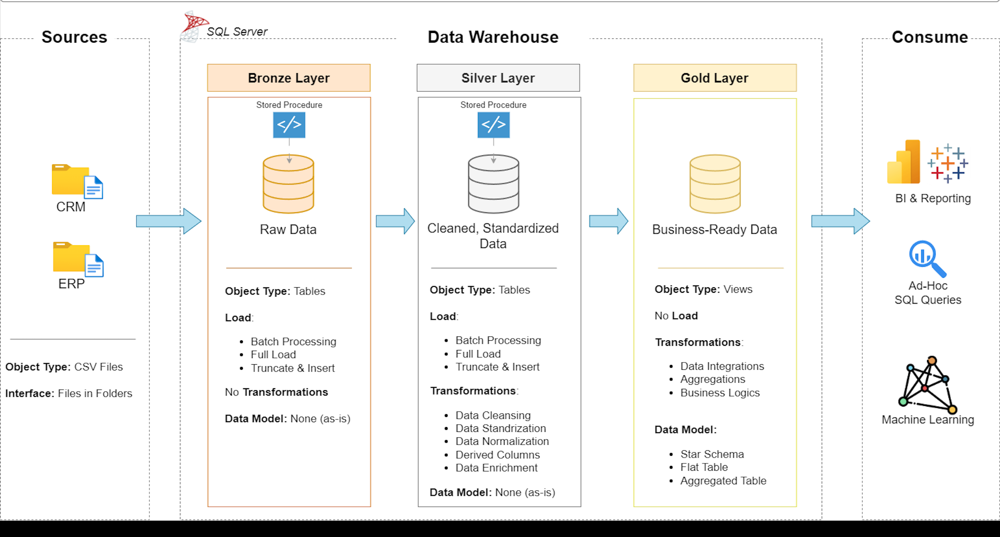

# 📊 Data Warehouse & Analytics Project  

Welcome to the **Data Warehouse & Analytics Project** repository! 🚀  
This portfolio project demonstrates an **end-to-end data warehousing and analytics solution** — from ingestion and transformation to reporting and insights — following **industry best practices** in data engineering and analytics.  

---

## 🏗️ Data Architecture  

The project implements the **Medallion Architecture** with three layers:  

1. **Bronze Layer** – Raw data ingestion from CSV files (ERP & CRM) into SQL Server.  
2. **Silver Layer** – Data cleansing, standardization, and normalization for consistency.  
3. **Gold Layer** – Business-ready **star schema** optimized for analytics and reporting.  

---

## 📖 Project Overview  

**Key Deliverables:**  
- **Data Architecture** – Modern warehouse design using Bronze, Silver, and Gold layers.  
- **ETL Pipelines** – End-to-end data loading and transformation into SQL Server.  
- **Data Modeling** – Fact & dimension tables tailored for analytical workloads.  
- **Analytics & Reporting** – SQL queries and dashboards to deliver actionable insights.  

**Skills Demonstrated:**  
- SQL Development  
- Data Architecture & Engineering  
- ETL Pipeline Development  
- Data Modeling (Star Schema)  
- Data Analytics & BI  

---

## 🚀 Project Requirements  

### **Data Engineering – Building the Warehouse**  
**Objective:** Create a modern data warehouse in SQL Server to consolidate sales data for analytics.  

**Specifications:**  
- Import from **ERP** & **CRM** (CSV files).  
- Cleanse & fix data quality issues.  
- Integrate into a **single analytical model**.  
- Scope limited to the latest dataset (no historization).  
- Document the **data model** for both technical and business users.  

---

### **Data Analysis – BI & Reporting**  
**Objective:** Deliver SQL-based insights into:  
- Customer Behavior  
- Product Performance  
- Sales Trends  

These insights enable **data-driven strategic decision-making** for stakeholders.  

